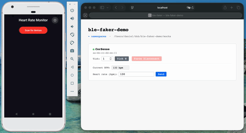

# ble-faker

[](https://github.com/dmanto/ble-faker/actions/workflows/ci.yml)
[](https://www.npmjs.com/package/ble-faker)
[](https://github.com/dmanto/ble-faker/blob/main/LICENSE)

Scriptable BLE peripheral simulator for React Native developers. Define your hardware's behavior in JavaScript, connect your app to it — no physical device required.

---

## Why ble-faker?

If you're building a React Native app that talks to BLE hardware, you've probably felt this pain:

- You need the physical device nearby for every change you want to test
- The device has limited availability, limited firmware control, or both
- Automated tests and CI runs can't include live hardware
- Demoing to stakeholders means praying the device cooperates

**ble-faker** replaces the physical device on your dev machine. Your app code stays unchanged — the same `react-native-ble-plx` calls that talk to real hardware talk to ble-faker instead. You get a browser dashboard to watch characteristic values change in real time and inject inputs without touching the app.



---

## Your app code stays the same

The key point: ble-faker ships a drop-in replacement for `react-native-ble-plx`. You configure Metro to redirect the import — that's it. Every `connectToDevice`, `monitorCharacteristicForService`, and `writeCharacteristicWithResponseForService` call in your app works exactly as before, against simulated hardware.

---

## Getting Started

### 1. Install

```shell
npm install --save-dev ble-faker
# or
pnpm add -D ble-faker
```

### 2. Create a mock folder

```text
mocks/
└── heart-rate-monitors/     ← category folder (one per device type)
    ├── gatt-profile.json    ← GATT structure
    └── FF-00-11-22-33-02.js ← device logic, named by MAC address
```

**`gatt-profile.json`** — mirrors the `addMockDevice()` payload from `react-native-ble-plx-mock`:

```json
{
  "serviceUUIDs": ["180D"],
  "isConnectable": true,
  "mtu": 247,
  "services": [
    {
      "uuid": "180D",
      "characteristics": [
        { "uuid": "2A37", "properties": { "read": true, "notify": true } },
        { "uuid": "2A39", "properties": { "write": true } }
      ]
    }
  ]
}
```

**`FF-00-11-22-33-02.js`** — device logic:

```js
export default function (state, event) {
  if (event.kind === "start") {
    return [
      { name: "HR Monitor", rssi: -65 },
      { vars: { hr: 72 } },
      { out: [{ name: "bpm", label: "Heart Rate (bpm)" }] },
    ];
  }

  if (event.kind === "tick") {
    const hr = Number(state.vars.hr);
    return [["2A37", utils.packUint16(hr)], { set: { bpm: String(hr) } }];
  }

  if (event.kind === "notify" && event.uuid === "2A39") {
    // App wrote to the control point — reset heart rate
    return [{ vars: { hr: 72 } }];
  }

  return [];
}
```

> **No code at all?** Just `touch FF-00-11-22-33-02.js`. ble-faker auto-generates browser controls from the GATT profile — output fields for readable/notifiable characteristics, input fields for writable ones. Good enough to verify your profile is wired up correctly before you write any logic.

### 3. Configure Metro

In your `metro.config.js`, add the ble-faker mock redirect under a `BLE_MOCK` env flag:

```js
const { getDefaultConfig } = require("expo/metro-config"); // or @react-native/metro-config
const path = require("path");
const fs = require("fs");

const config = getDefaultConfig(__dirname);

if (process.env.BLE_MOCK === "true") {
  // Read the port from the running server's state file
  let bleFakerPort = 58083;
  try {
    const state = JSON.parse(
      fs.readFileSync(
        path.join(process.env.HOME, ".ble-faker-server.json"),
        "utf8",
      ),
    );
    if (state.port) bleFakerPort = state.port;
  } catch {}

  // Where your mock folder lives (parent of category folders)
  const mockDir = path.join(__dirname, "mocks");
  const mockLabel = "My App";

  // Resolve the ble-faker package root
  const bleFakerRoot = path.dirname(require.resolve("ble-faker/package.json"));

  config.watchFolders = [...(config.watchFolders ?? []), bleFakerRoot];

  // Serve config to the mock library
  config.server = {
    ...config.server,
    enhanceMiddleware: (middleware) => (req, res, next) => {
      if (req.url === "/ble-faker-config") {
        res.setHeader("Content-Type", "application/json");
        res.end(
          JSON.stringify({
            port: bleFakerPort,
            dir: mockDir,
            label: mockLabel,
          }),
        );
        return;
      }
      middleware(req, res, next);
    },
  };

  // Redirect react-native-ble-plx → ble-faker mock
  const originalResolve = config.resolver.resolveRequest;
  config.resolver.resolveRequest = (context, moduleName, platform) => {
    if (moduleName === "react-native-ble-plx") {
      return {
        filePath: path.join(bleFakerRoot, "dist/mock.js"),
        type: "sourceFile",
      };
    }
    if (context.originModulePath.startsWith(bleFakerRoot)) {
      return (originalResolve ?? context.resolveRequest)(
        { ...context, originModulePath: __filename },
        moduleName,
        platform,
      );
    }
    return (originalResolve ?? context.resolveRequest)(
      context,
      moduleName,
      platform,
    );
  };
}

module.exports = config;
```

### 4. Add scripts to your `package.json`

```json
"scripts": {
  "ble:start":  "ble-faker --port 58083",
  "ble:stop":   "ble-faker stop",
  "start:mock": "cross-env BLE_MOCK=true expo start"
}
```

`cross-env` handles the env var on Windows — add it with `npm install --save-dev cross-env`.

### 5. Start the server

```shell
npm run ble:start
```

### 6. Run your app with the mock enabled

```shell
npm run start:mock
```

Restart Metro (not just reload) whenever you change `metro.config.js`.

### 7. Open the browser dashboard

`http://localhost:58083` — lists all namespaces. Click through to a device to see its live output fields and interact with it via input controls.

---

## Device Logic Reference

### Events

| `event.kind` | When                                                                       | Extra fields               |
| ------------ | -------------------------------------------------------------------------- | -------------------------- |
| `start`      | Namespace created or device file saved. Use to initialize `state.vars`.    | —                          |
| `connect`    | App establishes a BLE connection                                           | —                          |
| `disconnect` | BLE connection closes. `vars` updates persist; char updates are discarded. | —                          |
| `tick`       | 1-second timer — only fires while a connection is open                     | —                          |
| `advertise`  | Server building the device list for the app's scan                         | —                          |
| `notify`     | App wrote to a characteristic                                              | `uuid`, `payload` (base64) |
| `input`      | Browser UI form submitted                                                  | `id`, `payload` (string)   |

### Return commands

| Shape                          | Effect                                                  |
| ------------------------------ | ------------------------------------------------------- |
| `['uuid', base64]`             | Push a characteristic value to the app                  |
| `{ name, rssi, … }`            | Patch the advertising packet (`Partial<Device>` fields) |
| `{ vars: { key: value } }`     | Persist values into `state.vars` for the next call      |
| `{ in: [{ name, label }] }`    | Define browser input controls                           |
| `{ out: [{ name, label }] }`   | Define browser output display fields                    |
| `{ set: { field: 'value' } }`  | Push a string to a named browser output field           |
| `{ disconnect: true }`         | Simulate a device disconnection                         |
| `{ readError: { uuid } }`      | Make the app's next characteristic read for `uuid` fail |
| `{ clearReadError: { uuid } }` | Clear a previously set read error                       |

### State

| Field         | Type                      | Description                                          |
| ------------- | ------------------------- | ---------------------------------------------------- |
| `state.dev`   | `Partial<Device>`         | Device advertising info (includes `id` as MAC)       |
| `state.vars`  | `Record<string, unknown>` | Your persisted values — read-only, write via `vars:` |
| `state.chars` | `Record<string, string>`  | Current characteristic values by UUID (base64)       |
| `state.ui`    | `{ ins, outs }`           | Current browser UI definition                        |

### Available globals

No imports needed inside device logic files:

| Global                   | Description                   |
| ------------------------ | ----------------------------- |
| `Buffer`                 | Node.js Buffer                |
| `Uint8Array`, `DataView` | Binary views                  |
| `utils.toBase64(arr)`    | `Uint8Array → base64 string`  |
| `utils.fromBase64(str)`  | `base64 → Buffer`             |
| `utils.packUint16(n)`    | little-endian uint16 → base64 |
| `console.log/warn/error` | forwarded to server stdout    |

### Sandbox

Logic files run in an isolated `node:vm` context with a 50ms CPU budget per call. No access to `process`, `require`, the filesystem, or the network.

---

## Testing

The `ble-faker/test` client gives you a typed API to control simulated devices and assert on their behavior from test code — no HTTP or WebSocket knowledge required.

The React Native app runs with `BLE_MOCK=true` (driven by Detox, Maestro, or similar), while the test client controls the device side at the same time. For example, Detox taps a button in the app while your test advances the simulated clock:

```ts
it("shows updated temperature after device tick", async () => {
  const device = ns.device("ff-00-11-22-33-02");
  await detox.element(by.id("connectBtn")).tap();
  await device.tickN(60); // advance 1 simulated minute
  await expect(detox.element(by.id("temp"))).toHaveText("99°F");
});
```

### Setup

```ts
import { BleTestClient } from "ble-faker/test";
import { before, after, describe, it } from "node:test";

describe("heart rate monitor", () => {
  const client = BleTestClient.connect(); // reads running server from ~/.ble-faker-server.json
  let ns: Awaited<ReturnType<typeof client.mount>>;

  before(async () => {
    ns = await client.mount({ dir: "./mocks", label: "HR test" });
  });

  after(async () => {
    await client.unmount(ns);
  });

  it("pushes a heart rate characteristic on each tick", async () => {
    const device = ns.device("ff-00-11-22-33-02");
    await device.tickN(1);
    await device.waitForChar("2a37", /.+/);
  });
});
```

### Controlling the device

| Method                        | Description                                     |
| ----------------------------- | ----------------------------------------------- |
| `device.input(name, payload)` | Simulate a browser UI form submission           |
| `device.tickN(n)`             | Advance the device clock by `n` ticks (max 100) |
| `device.forceDisconnect()`    | Trigger a simulated BLE disconnection           |

### Asserting

Both methods throw an `AssertionError` (from `node:assert`) on timeout — no manual `assert` call needed. `pattern` can be a string (exact match) or a `RegExp`. Default timeout is 5000ms.

Both also check the current value immediately — if it already matches when called, they return right away.

| Method                                          | Description                               |
| ----------------------------------------------- | ----------------------------------------- |
| `device.waitForOutput(name, pattern, timeout?)` | Wait until a browser output field matches |
| `device.waitForChar(uuid, pattern, timeout?)`   | Wait until a characteristic value matches |

### Inspecting last seen values

After any `waitFor*` call — including ones that timed out and threw — the last observed value is accessible:

```ts
try {
  await device.waitForOutput("mmode_out", "M", 3000);
} catch (e) {
  console.log(device.lastOutput("mmode_out")); // e.g. "B" — what was actually seen
  throw e;
}
```

| Method                    | Description                                |
| ------------------------- | ------------------------------------------ |
| `device.lastOutput(name)` | Last value seen for a browser output field |
| `device.lastChar(uuid)`   | Last value seen for a characteristic       |

### Running the server in CI

```yaml
# GitHub Actions example
- name: Start ble-faker
  run: npx ble-faker --port 58083 &

- name: Run tests
  run: npm test

- name: Stop ble-faker
  run: npx ble-faker stop
  if: always()
```

---

## Programmatic API

Embed the server in your own tooling or integration tests:

```ts
import { bleMockServer } from "ble-faker";

await bleMockServer.start({ dir: "./mocks", port: 58083 });
const { pid, url, port } = await bleMockServer.get();
await bleMockServer.stop();
```

---

## Development commands

| Command           | Description                             |
| :---------------- | :-------------------------------------- |
| `pnpm dev`        | Watch mode (rebuilds on source changes) |
| `pnpm build`      | Compile to `dist/`                      |
| `pnpm test`       | Run tests (Node.js native test runner)  |
| `pnpm build:test` | Build + test in one step                |
| `pnpm lint`       | oxlint                                  |

---

## Contributing

PRs welcome. See [docs/ARCHITECTURE.md](docs/ARCHITECTURE.md) for the internal design.

**License:** MIT
